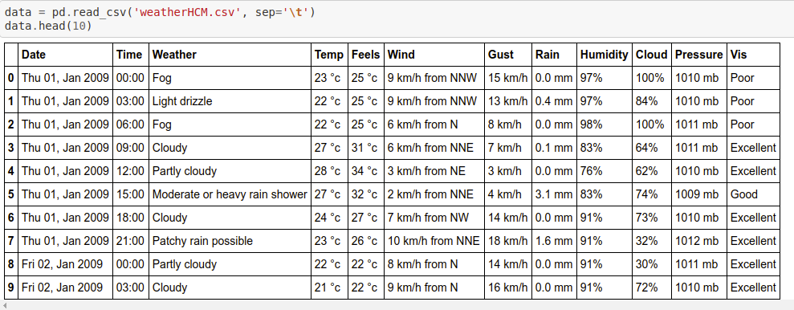
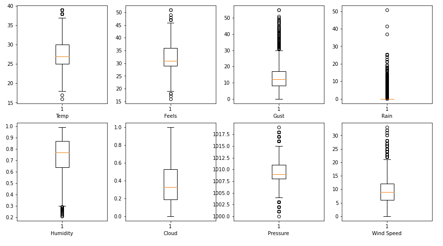
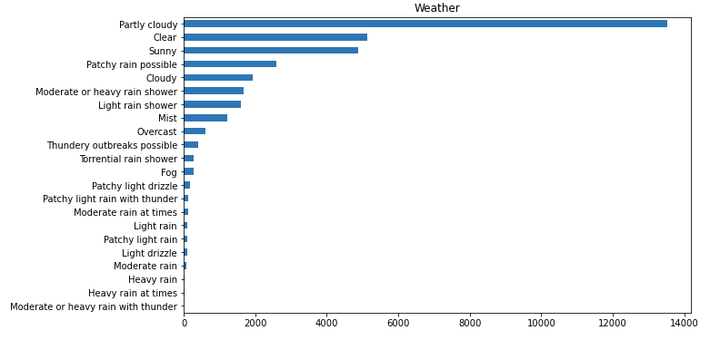
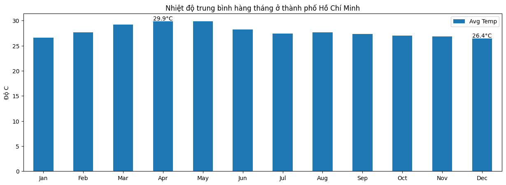
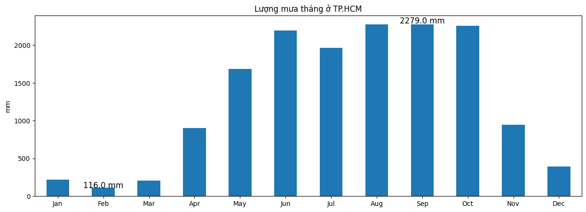
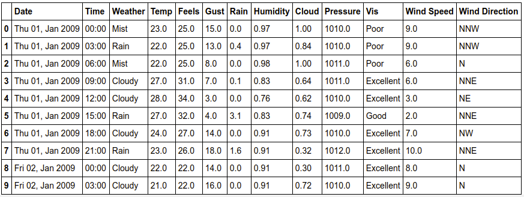
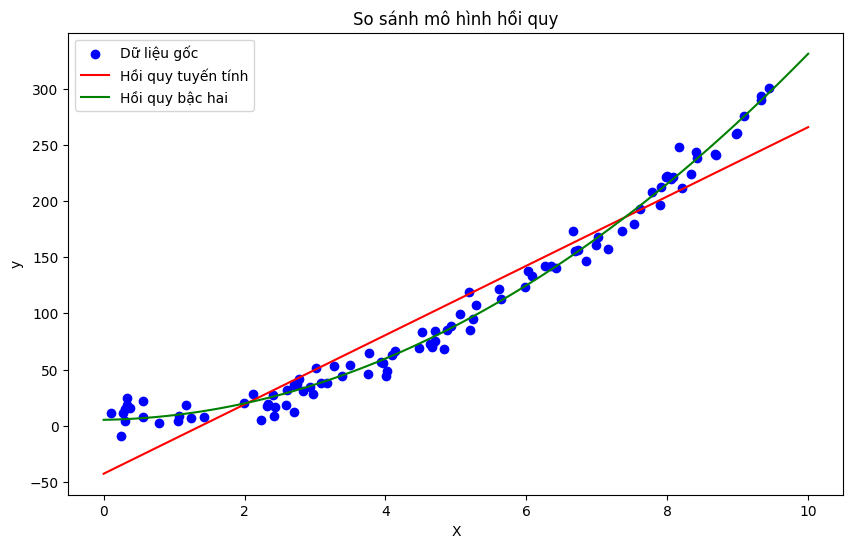

# Đồ án cuối kỳ môn Khoa học dữ liệu ứng dụng
# Đề tài: Dự đoán thời tiết của thành phố Hồ Chí Minh
## 1. Mục tiêu của đề tài:
**Dự báo thời tiết** là một ngành ứng dụng của khoa học và công nghệ để tiên đoán trạng thái và vị trí của bầu khí quyển trong tương lai gần. Loài người đã nỗ lực dự báo thời tiết một cách không chính thức từ nhiều thiên niên kỳ trước, và việc dự báo thời tiết một cách chính thức bắt đầu từ thế kỷ mười chín. Công tác dự báo thời tiết được thực hiện bằng cách thu thập số liệu về trạng thái hiện tại của bầu khí quyển và áp dụng những hiểu biết khoa học về các quá trình của khí quyển để tiên đoán sự tiến triển của khí quyển *(Theo Wikipedia).*  

Dự báo thời tiết có một vai trò to lớn trong đời sống kinh tế, xã hội. Dự báo đúng sẽ giúp con người đưa ra những quyết định đúng đắn, dự báo sai, có thể sẽ là những hậu quả vô cùng khủng khiếp (nếu như đang dự đoán các thiên tai).

Trong đề tài này, chúng ta sẽ tiến hành dự đoán thời tiết của thành phố Hồ Chí Minh. Câu hỏi cần đặt ra là: Thời tiết bị ảnh hưởng bởi các yếu tố nhiệt độ, độ ẩm không khí, lượng mưa, lượng mây, tốc độ gió, hướng gió,... như thế nào? Và từ các thông tin thời tiết của những ngày trong quá khứ, ta có thể dự đoán các giá trị thời tiết của các ngày tiếp theo hay không?

## 2. Thu thập dữ liệu
Dữ liệu được thu thập bằng cách parse HTML từ trang web: https://www.worldweatheronline.com/ho-chi-minh-city-weather-history/vn.aspx  
Các thư viện sử dụng: request_html, selenium.

## 3. Preprocessing & EDA
Dữ liệu crawl từ trang web là dữ liệu thời tiết của thành phố Hồ Chí Minh từ ngày 01/01/2009 đến ngày 20/12/2020 và được cập nhật sau mỗi 3 giờ. 

Dữ liệu gồm **34976 dòng và 12 cột**. Mỗi dòng bao gồm các thông tin về thời tiết trong 3 giờ:
- Date: ngày
- Time: thời gian trong ngày
- Weather: tình trạng thời tiết
- Temp: nhiệt độ (trong đề tài, ta sẽ dự đoán giá trị này)
- Feels: nhiệt độ thực sự cảm nhận được
- Wind: tốc độ gió
- Gust: tốc độ gió giật
- Rain: lượng mưa
- Humidity: độ ẩm
- Cloud: mật độ mây
- Pressure: áp suất không khí
- Vis: tầm nhìn

    

Các bước tiền xử lý và phân tích thông kê trên dữ liệu được trình bày chi tiết trong file ***"Preprocessing and EDA.ipynb***.

Một số kết quả:

*Phân bố của dữ liệu dạng số*  

*Phân bố của biến weather*  

*Nhiệt độ trung bình tháng*  

*Lượng mưa trung bình tháng*

## 4. Mô hình dự đoán và kết quả
Sử dụng ***Linear Regression*** và **Quadratic regression**  để dự đoán giá trị nhiệt độ. Các bước chi tiết xem file ** Weather model.ipynb***

Kết quả của mô hình (dự đoán trên 100 dòng dữ liệu cuối):

**Tự đánh giá đồ án**
- Kết quả: mô hình cho kết quả dự báo nhiệt độ khá tốt (độ lỗi thấp chỉ khoảng 0.0036). 
- Thiếu sót: chỉ mới dự đoán trên thuộc tính nhiệt độ, chưa tiến hành trên các thuộc tính khác.
- Có thể phát triển mô hình bằng cách dự đoán tất cả các giá trị thời tiết của các ngày tiếp theo (hoặc tuần), nếu dữ liệu nhiều hơn, có thể sử dụng deep learning để có thể cho kết quả chính xác hơn.
## 5. Hướng dẫn chạy code
Các thư viện cần cài đặt: numpy, pandas, matplotlib, request_html, selenium, scikit-learn, scipy.
#GIẤY PHÉP 
MIT License

Copyright (c) 2023 Md. Shakil Hossain

Permission is hereby granted, free of charge, to any person obtaining a copy
of this software and associated documentation files (the "Software"), to deal
in the Software without restriction, including without limitation the rights
to use, copy, modify, merge, publish, distribute, sublicense, and/or sell
copies of the Software, and to permit persons to whom the Software is
furnished to do so, subject to the following conditions:

The above copyright notice and this permission notice shall be included in all
copies or substantial portions of the Software.

THE SOFTWARE IS PROVIDED "AS IS", WITHOUT WARRANTY OF ANY KIND, EXPRESS OR
IMPLIED, INCLUDING BUT NOT LIMITED TO THE WARRANTIES OF MERCHANTABILITY,
FITNESS FOR A PARTICULAR PURPOSE AND NONINFRINGEMENT. IN NO EVENT SHALL THE
AUTHORS OR COPYRIGHT HOLDERS BE LIABLE FOR ANY CLAIM, DAMAGES OR OTHER
LIABILITY, WHETHER IN AN ACTION OF CONTRACT, TORT OR OTHERWISE, ARISING FROM,
OUT OF OR IN CONNECTION WITH THE SOFTWARE OR THE USE OR OTHER DEALINGS IN THE
SOFTWARE.

